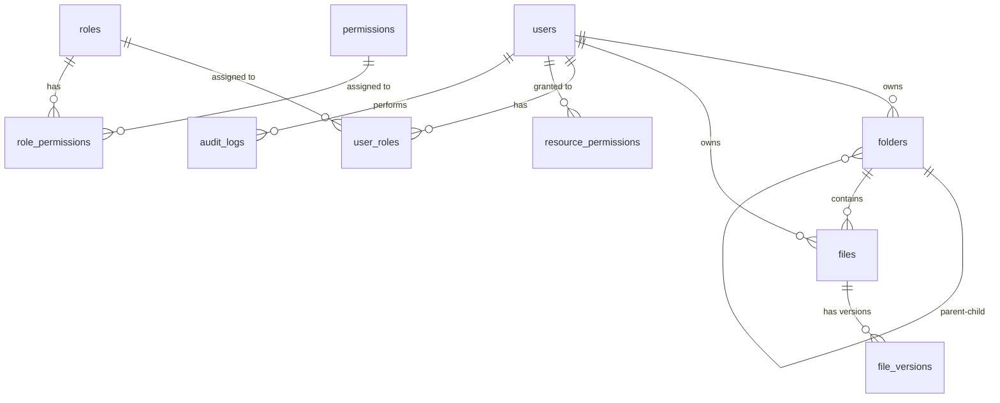

# TÀI LIỆU PHÂN TÍCH CHI TIẾT CƠ SỞ DỮ LIỆU & CẤU TRÚC DOMAIN
## HỆ THỐNG FILE SERVER & PERMISSION SYSTEM

Tài liệu này giải thích chi tiết thiết kế cơ sở dữ liệu, các thực thể (JPA Entities) đã được triển khai trong ứng dụng Spring Boot Backend, cấu trúc các trường thông tin (fields), kiểu dữ liệu (data types), ràng buộc (constraints) và ý nghĩa nghiệp vụ của từng bảng.

---

## 1. TỔNG QUAN KIẾN TRÚC & MỐI QUAN HỆ THỰC THỂ (ERD)

Hệ thống quản lý tệp tin và phân quyền sử dụng mô hình kết hợp **RBAC (Role-Based Access Control)** và **ACL (Access Control List)**, hỗ trợ lưu trữ nhiều phiên bản tệp tin (File Versioning), quản lý cây thư mục dạng đường dẫn định danh (Materialized Path), kiểm soát hạn mức dung lượng (Quota) và ghi chép nhật ký hoạt động (Audit Log).

---

## 2. GIẢI THÍCH CHI TIẾT TỪNG BẢNG & TỪNG TRƯỜNG (DATABASE DICTIONARY)

> [!NOTE]
> Tất cả các bảng đều được cấu hình cơ chế tự động khởi tạo thời gian tạo (`created_at`) và thời gian cập nhật gần nhất (`updated_at`) để phục vụ kiểm toán hệ thống.

---

### 2.1 Bảng `users` (Thực thể `User`)
Bảng này quản lý thông tin tài khoản người dùng trong hệ thống và thông số hạn mức dung lượng lưu trữ của họ.

| Trường (Field) | Kiểu Dữ Liệu JPA | Tên Cột DB | Ràng Buộc | Ý Nghĩa Nghiệp Vụ |
| :--- | :--- | :--- | :--- | :--- |
| `id` | `Long` | `id` | `PRIMARY KEY`, `AUTO_INCREMENT` | ID duy nhất tự tăng của người dùng. |
| `username` | `String` | `username` | `NOT NULL`, `UNIQUE` | Tên đăng nhập của người dùng. Không trùng lặp. |
| `email` | `String` | `email` | `NOT NULL`, `UNIQUE` | Địa chỉ email dùng để liên hệ/khôi phục mật khẩu. |
| `password` | `String` | `password` | `NOT NULL` | Mật khẩu tài khoản (được mã hóa bảo mật). |
| `fullName` | `String` | `full_name` | `NULLABLE` | Họ và tên đầy đủ của người dùng. |
| `status` | `String` | `status` | `NULLABLE` | Trạng thái tài khoản (Ví dụ: `ACTIVE` - Hoạt động, `INACTIVE` - Bị khóa). |
| `usedStorage` | `Long` | `used_storage` | `DEFAULT 0` | Dung lượng đã sử dụng hiện tại (tính bằng **Bytes**). Cập nhật mỗi khi upload/xóa file. |
| `maxStorage` | `Long` | `max_storage` | `DEFAULT 10GB` | Hạn mức dung lượng tối đa được phép dùng (tính bằng **Bytes**). Mặc định là `10,737,418,240 Bytes` (10 GB). |
| `createdAt` | `LocalDateTime` | `created_at` | `NOT NULL`, `UPDATABLE = false` | Thời điểm đăng ký/tạo tài khoản trên hệ thống. |
| `updatedAt` | `LocalDateTime` | `updated_at` | `NULLABLE` | Thời điểm cập nhật thông tin tài khoản gần nhất. |

---

### 2.2 Bảng `folders` (Thực thể `Folder`)
Bảng quản lý cấu trúc cây thư mục. Hệ thống sử dụng phương pháp **Materialized Path** để tối ưu hóa hiệu năng truy vấn cây thư mục con mà không cần đệ quy sâu trong DB.

| Trường (Field) | Kiểu Dữ Liệu JPA | Tên Cột DB | Ràng Buộc | Ý Nghĩa Nghiệp Vụ |
| :--- | :--- | :--- | :--- | :--- |
| `id` | `Long` | `id` | `PRIMARY KEY`, `AUTO_INCREMENT` | ID duy nhất của thư mục. |
| `name` | `String` | `name` | `NOT NULL` | Tên thư mục (không chứa ký tự đặc biệt). |
| `parent` | `Folder` | `parent_id` | `FOREIGN KEY` -> `folders(id)`, `NULLABLE` | Thư mục cha chứa thư mục này. Nếu bằng `NULL` thì thư mục này nằm ở thư mục gốc (Root). |
| `path` | `String` | `path` | `NOT NULL` | Đường dẫn đầy đủ dạng chuỗi (Materialized Path). Ví dụ: `/root/documents/projects`. Giúp tìm kiếm cây thư mục con cực nhanh bằng toán tử `LIKE '/root/documents/%'`. |
| `owner` | `User` | `owner_id` | `FOREIGN KEY` -> `users(id)`, `NOT NULL` | Người dùng sở hữu thư mục này (có toàn quyền đối với thư mục). |
| `isDeleted` | `Boolean` | `is_deleted` | `DEFAULT false` | Đánh dấu xóa mềm (Soft Delete). Khi bằng `true`, thư mục được coi là đã nằm trong thùng rác. |
| `createdAt` | `LocalDateTime` | `created_at` | `NOT NULL`, `UPDATABLE = false` | Thời điểm thư mục được tạo. |
| `updatedAt` | `LocalDateTime` | `updated_at` | `NULLABLE` | Thời điểm cập nhật thư mục gần nhất. |

---

### 2.3 Bảng `files` (Thực thể `FileEntity`)
Bảng lưu trữ thông tin siêu dữ liệu (Metadata) của các tệp tin được tải lên hệ thống. Tệp tin thực tế sẽ được đẩy lên **MinIO Object Storage**.

> [!WARNING]
> Thực thể được đặt tên là `FileEntity` trong code để tránh xung đột với class `java.io.File` của Java SDK, nhưng tên bảng ánh xạ trong DB vẫn là `files`.

| Trường (Field) | Kiểu Dữ Liệu JPA | Tên Cột DB | Ràng Buộc | Ý Nghĩa Nghiệp Vụ |
| :--- | :--- | :--- | :--- | :--- |
| `id` | `Long` | `id` | `PRIMARY KEY`, `AUTO_INCREMENT` | ID duy nhất của tệp tin. |
| `fileName` | `String` | `file_name` | `NOT NULL` | Tên tệp tin khi hiển thị (ví dụ: `report.pdf`). |
| `extension` | `String` | `extension` | `NULLABLE` | Phần mở rộng của file (ví dụ: `pdf`, `png`, `docx`). |
| `mimeType` | `String` | `mime_type` | `NULLABLE` | Định dạng truyền tải internet (ví dụ: `application/pdf`, `image/png`). Tránh giả mạo extension. |
| `size` | `Long` | `size` | `NOT NULL` | Dung lượng tệp tin (tính bằng **Bytes**). |
| `storagePath` | `String` | `storage_path` | `NOT NULL` | Đường dẫn vật lý thực tế trên MinIO Bucket. Ví dụ: `users/1/2026/05/293a1f-report.pdf`. |
| `checksum` | `String` | `checksum` | `NOT NULL` | Mã băm kiểm tra toàn vẹn (MD5 hoặc SHA-256). Giúp chống trùng lặp dữ liệu (Deduplication) và xác thực file không bị hỏng. |
| `version` | `Integer` | `version` | `DEFAULT 1` | Phiên bản hiện tại của tệp tin. Tự tăng lên khi người dùng tải lên phiên bản đè. |
| `folder` | `Folder` | `folder_id` | `FOREIGN KEY` -> `folders(id)`, `NULLABLE` | Thư mục chứa tệp tin này. Nếu `NULL` tức là file nằm ở thư mục gốc (Root). |
| `owner` | `User` | `owner_id` | `FOREIGN KEY` -> `users(id)`, `NOT NULL` | Người dùng sở hữu tệp tin (có quyền tối cao với file). |
| `status` | `String` | `status` | `NULLABLE` | Trạng thái file (ví dụ: `ACTIVE` - Hoạt động, `ARCHIVED` - Lưu trữ). |
| `isDeleted` | `Boolean` | `is_deleted` | `DEFAULT false` | Xóa mềm (Soft Delete). |
| `createdAt` | `LocalDateTime` | `created_at` | `NOT NULL`, `UPDATABLE = false` | Thời điểm tệp tin được upload lên hệ thống. |
| `updatedAt` | `LocalDateTime` | `updated_at` | `NULLABLE` | Thời điểm cập nhật tệp tin gần nhất. |

---

### 2.4 Bảng `file_versions` (Thực thể `FileVersion`)
Bảng hỗ trợ cơ chế lưu lịch sử các phiên bản cũ của tệp tin (File Versioning). Khi tệp tin bị tải đè, thông tin phiên bản cũ sẽ được đóng băng vào bảng này để người dùng có thể khôi phục lại khi cần.

| Trường (Field) | Kiểu Dữ Liệu JPA | Tên Cột DB | Ràng Buộc | Ý Nghĩa Nghiệp Vụ |
| :--- | :--- | :--- | :--- | :--- |
| `id` | `Long` | `id` | `PRIMARY KEY`, `AUTO_INCREMENT` | ID duy nhất của bản ghi phiên bản. |
| `file` | `FileEntity` | `file_id` | `FOREIGN KEY` -> `files(id)`, `NOT NULL` | Tệp tin gốc mà phiên bản này thuộc về. |
| `version` | `Integer` | `version` | `NOT NULL` | Số hiệu phiên bản (ví dụ: `1`, `2`, `3`). |
| `storagePath` | `String` | `storage_path` | `NOT NULL` | Đường dẫn lưu trữ vật lý của phiên bản cũ này trên MinIO. |
| `checksum` | `String` | `checksum` | `NOT NULL` | Mã hash toàn vẹn của riêng phiên bản này. |
| `size` | `Long` | `size` | `NOT NULL` | Dung lượng của riêng phiên bản này (tính bằng **Bytes**). |
| `createdBy` | `String` | `created_by` | `NULLABLE` | Username của người đã thực hiện tải lên phiên bản này. |
| `createdAt` | `LocalDateTime` | `created_at` | `NOT NULL`, `UPDATABLE = false` | Thời điểm phiên bản này được tạo ra. |

---

### 2.5 Bảng `roles` (Thực thể `Role`)
Quản lý các chức danh, vai trò chính trong hệ thống (RBAC).

| Trường (Field) | Kiểu Dữ Liệu JPA | Tên Cột DB | Ràng Buộc | Ý Nghĩa Nghiệp Vụ |
| :--- | :--- | :--- | :--- | :--- |
| `id` | `Long` | `id` | `PRIMARY KEY`, `AUTO_INCREMENT` | ID duy nhất của Role. |
| `code` | `String` | `code` | `NOT NULL`, `UNIQUE` | Mã định danh vai trò viết hoa (ví dụ: `ADMIN`, `EDITOR`, `VIEWER`). |
| `name` | `String` | `name` | `NOT NULL` | Tên hiển thị thân thiện (ví dụ: `Quản trị viên`, `Người biên tập`). |

---

### 2.6 Bảng `permissions` (Thực thể `Permission`)
Quản lý danh mục các hành động chi tiết có thể thực hiện trên tài nguyên hệ thống.

| Trường (Field) | Kiểu Dữ Liệu JPA | Tên Cột DB | Ràng Buộc | Ý Nghĩa Nghiệp Vụ |
| :--- | :--- | :--- | :--- | :--- |
| `id` | `Long` | `id` | `PRIMARY KEY`, `AUTO_INCREMENT` | ID duy nhất của Permission. |
| `code` | `String` | `code` | `NOT NULL`, `UNIQUE` | Mã hành động viết hoa (ví dụ: `FILE_READ`, `FILE_WRITE`, `FILE_DELETE`, `FOLDER_CREATE`). |
| `name` | `String` | `name` | `NOT NULL` | Mô tả hành động (ví dụ: `Quyền đọc tệp tin`, `Quyền xóa thư mục`). |

---

### 2.7 Bảng trung gian `user_roles`
Bảng liên kết nhiều-nhiều (Many-to-Many) giữa người dùng và vai trò. Một người dùng có thể sở hữu nhiều vai trò, và một vai trò có thể được gán cho nhiều người dùng.

* **`user_id`** (`FOREIGN KEY` -> `users(id)`): ID của người dùng.
* **`role_id`** (`FOREIGN KEY` -> `roles(id)`): ID của vai trò được gán.
* **`PRIMARY KEY`**: Gồm tổ hợp song song cả hai trường `(user_id, role_id)`.

---

### 2.8 Bảng trung gian `role_permissions`
Bảng liên kết nhiều-nhiều (Many-to-Many) giữa vai trò và quyền hạn chi tiết. Giúp định nghĩa xem một vai trò cụ thể thì được phép làm những gì.

* **`role_id`** (`FOREIGN KEY` -> `roles(id)`): ID của vai trò.
* **`permission_id`** (`FOREIGN KEY` -> `permissions(id)`): ID của quyền hạn chi tiết.
* **`PRIMARY KEY`**: Gồm tổ hợp song song cả hai trường `(role_id, permission_id)`.

---

### 2.9 Bảng `resource_permissions` (Thực thể `ResourcePermission` - Bảng ACL)
Đây là bảng cốt lõi phục vụ cơ chế **Access Control List (ACL)**. Giúp gán quyền động, chi tiết cho từng người dùng cụ thể trên từng File hoặc Folder cụ thể, vượt lên trên phân quyền tĩnh dạng Role.

| Trường (Field) | Kiểu Dữ Liệu JPA | Tên Cột DB | Ràng Buộc | Ý Nghĩa Nghiệp Vụ |
| :--- | :--- | :--- | :--- | :--- |
| `id` | `Long` | `id` | `PRIMARY KEY`, `AUTO_INCREMENT` | ID bản ghi cấp quyền. |
| `resourceType` | `String` | `resource_type` | `NOT NULL` | Loại tài nguyên được phân quyền (Ví dụ: `FILE` hoặc `FOLDER`). |
| `resourceId` | `Long` | `resource_id` | `NOT NULL` | ID của tệp tin hoặc thư mục cụ thể được nhắm tới. |
| `user` | `User` | `user_id` | `FOREIGN KEY` -> `users(id)`, `NOT NULL` | Người dùng được trao quyền hạn này. |
| `permissionCode` | `String` | `permission_code` | `NOT NULL` | Quyền cụ thể được gán (Ví dụ: `FILE_READ`, `FILE_WRITE`). |
| `allow` | `Boolean` | `allow` | `DEFAULT true` | `true` có nghĩa là **Cho phép** (Allow), `false` có nghĩa là **Chặn/Từ chối** trực tiếp (Deny). |
| `createdBy` | `String` | `created_by` | `NULLABLE` | Người thực hiện cấp quyền này (Username). |
| `createdAt` | `LocalDateTime` | `created_at` | `NOT NULL`, `UPDATABLE = false` | Thời điểm gán quyền. |

---

### 2.10 Bảng `audit_logs` (Thực thể `AuditLog`)
Bảng ghi lại toàn bộ nhật ký các hoạt động quan trọng trong hệ thống để phục vụ công tác thanh tra bảo mật dữ liệu.

| Trường (Field) | Kiểu Dữ Liệu JPA | Tên Cột DB | Ràng Buộc | Ý Nghĩa Nghiệp Vụ |
| :--- | :--- | :--- | :--- | :--- |
| `id` | `Long` | `id` | `PRIMARY KEY`, `AUTO_INCREMENT` | ID của bản ghi nhật ký. |
| `user` | `User` | `user_id` | `FOREIGN KEY` -> `users(id)`, `NULLABLE` | Người dùng đã thực hiện thao tác này. Nếu bằng `NULL` thì đó là hành động ẩn danh (Anonymous). |
| `action` | `String` | `action` | `NOT NULL` | Hành động thực hiện (Ví dụ: `UPLOAD_FILE`, `DOWNLOAD_FILE`, `DELETE_FILE`, `CREATE_FOLDER`). |
| `resourceType` | `String` | `resource_type` | `NULLABLE` | Loại tài nguyên bị tác động (`FILE` hoặc `FOLDER`). |
| `resourceId` | `Long` | `resource_id` | `NULLABLE` | ID của tài nguyên bị tác động. |
| `ipAddress` | `String` | `ip_address` | `NULLABLE` | Địa chỉ IP của máy khách (Client IP) thực hiện yêu cầu. |
| `createdAt` | `LocalDateTime` | `created_at` | `NOT NULL`, `UPDATABLE = false` | Thời điểm hành động xảy ra. |

---

## 3. CÁC ĐIỂM SÁNG TRONG THIẾT KẾ CƠ SỞ DỮ LIỆU & BẢO MẬT

### 1. Phân Quyền Kết Hợp RBAC & ACL linh hoạt
* **RBAC (Vai trò)**: Đảm bảo phân quyền nhanh theo nhóm đối tượng (Admin có mọi quyền, Editor được ghi, Viewer chỉ được đọc).
* **ACL (Danh sách truy cập)**: Giải quyết các bài toán chia sẻ động (Người dùng A muốn chia sẻ duy nhất File X cho người dùng B đọc, mà không cho phép xem các file khác cùng thư mục).

### 2. Tối Ưu Hóa Cây Thư Mục Với Materialized Path
Trường `path` trong bảng `folders` lưu vết dạng `/root/documents/projects/java` giúp:
* Lấy toàn bộ thư mục con của thư mục `projects` bằng 1 câu query duy nhất: `SELECT * FROM folders WHERE path LIKE '/root/documents/projects/%' AND is_deleted = false`.
* Không cần viết các câu lệnh đệ quy phức tạp (Common Table Expressions - CTE) gây chậm cơ sở dữ liệu khi cây thư mục quá sâu.

### 3. Hạn Mức Dung Lượng (Quota System)
* Lưu trữ cột `used_storage` và `max_storage` trực tiếp ở bảng `users` giúp kiểm tra nhanh dung lượng trống của người dùng trước khi tiến hành upload mà không cần tính tổng dung lượng (SUM size) của tất cả các file trong DB, giảm tải tối đa cho hệ thống.

### 4. Đảm Bảo Toàn Vẹn Phiên Bản (File Versioning)
* Bảng `file_versions` lưu vết các phiên bản cũ giúp người dùng an tâm không sợ bị ghi đè mất dữ liệu gốc, đồng thời trường `checksum` giúp hệ thống chống tải lên trùng lặp (Dedup) tiết kiệm tài nguyên lưu trữ vật lý của MinIO.
